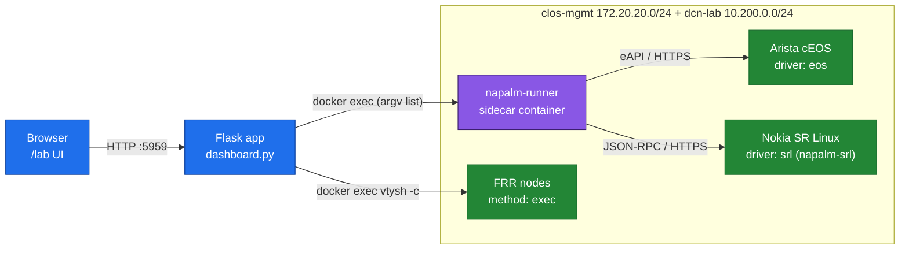
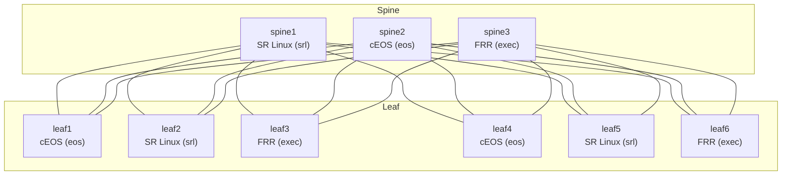
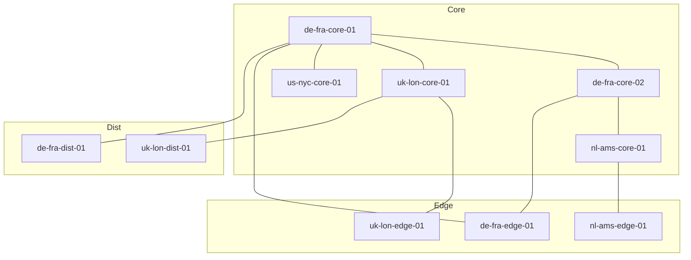
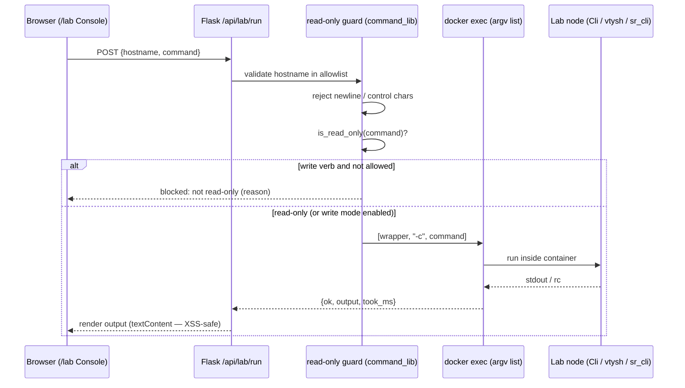
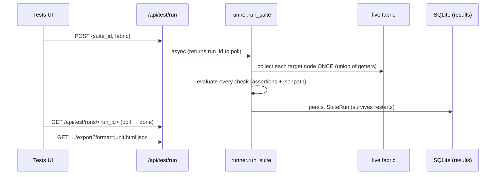

# NAPALM Live Lab

**An honest, live multivendor coverage matrix for NAPALM — plus a safe-by-default command console — running entirely in containerlab on one laptop.**

[](https://www.python.org/)
[](https://flask.palletsprojects.com/)
[](https://napalm.readthedocs.io/)
[](https://containerlab.dev/)
[](#tests)
[](./LICENSE)

---

## Why this exists

NAPALM's pitch is a single Python API that talks to any vendor — call `get_bgp_neighbors()` and you get the same normalized data structure whether the box runs Arista EOS, Cisco IOS-XR, or Juniper Junos. It's a genuinely good abstraction, and for the vendors with first-class drivers it largely delivers. But the moment you build a real multivendor fabric, the promise frays in ways the marketing never mentions, and the gaps are exactly where you find out the hard way — usually mid-automation, against production.

This lab makes those gaps **visible and reproducible** instead of surprising. It runs a live multivendor CLOS-EVPN fabric (3 spine + 6 leaf, mixing Arista cEOS, Nokia SR Linux, and FRRouting) plus a 10-router 3-Tier FRR network, and shows you — node by node, getter by getter — what NAPALM *actually* returns versus what it *claims* to.

The three realities it surfaces honestly:

- **cEOS (Arista) — first-class.** The `eos` driver ships in core NAPALM and talks eAPI over HTTPS. The standard getters work. This is what "NAPALM works" looks like.
- **SR Linux (Nokia) — partial, community-maintained.** There is no core driver; coverage comes from the separate `napalm-srl` community package over JSON-RPC. It's real, but it's a different package on a different maintenance cadence, and getter coverage is not 1:1 with EOS. The dashboard labels it as community-sourced rather than pretending it's the same tier.
- **FRR — no driver at all.** There is no NAPALM driver for FRRouting. The lab doesn't fake one. FRR nodes are collected via `docker exec ... vtysh -c "<cmd> json"`, and the results are mapped into NAPALM-shaped dicts (`get_bgp_neighbors`, `get_interfaces`, `get_interfaces_ip`) so the UI stays consistent — but each node is tagged `method: exec`, `napalm_supported: false`, and getters with no vtysh equivalent (LLDP, environment) are explicitly marked unsupported with a reason. **You see the seam, not a papered-over one.**

There's a second piece of honest engineering baked in: **the macOS-can't-route-to-containers problem.** On Docker Desktop for Mac, the host has no route to container management IPs — you cannot open an eAPI/JSON-RPC session from your laptop to `172.20.20.x` the way you could on native Linux Docker. NAPALM needs that L3 reachability, so on a Mac it simply can't connect. The fix is a **sidecar pattern**: a `napalm-runner` container attached to the lab's management networks runs the real NAPALM drivers from *inside* the fabric, and the host dispatches collection to it over `docker exec` (argv list, never a shell). Because every collection path — runner for `eos`/`srl`, `vtysh` for FRR — is `docker exec`-based, the exact same code runs identically on macOS and Linux. No VPN, no `route add`, no host networking hacks, no "works on my Linux box" caveat.

## Who it's for

- **Network engineers learning NAPALM** who want to run real getters against real (containerized) multivendor devices instead of reading driver docs and guessing what the output looks like.
- **Architects evaluating NAPALM's multivendor coverage before committing** — deciding whether NAPALM can underpin an automation platform across an Arista/Nokia/FRR (or mixed-vendor) estate, who need the coverage matrix *before* writing thousands of lines against an abstraction that's thinner than advertised on half their fleet.
- **Automation developers doing lab-driven development** who need a reproducible, disposable fabric to write and test collection/audit code against — with a known topology, known BGP/EVPN state, and zero risk to production.
- **Job seekers and engineers building a portfolio** who want a demonstrable, running artifact: a live multivendor fabric, a real NAPALM coverage matrix, and a security-conscious command console — concrete evidence of multivendor automation and containerlab fluency, not a slide deck.

## Elevator pitch

NAPALM Live Lab is a Flask dashboard that runs a live, multivendor containerlab fabric — Arista cEOS, Nokia SR Linux, and FRRouting across a 9-node CLOS-EVPN spine/leaf plus a 10-router 3-Tier network — and shows you the truth about NAPALM's multivendor promise: full coverage on cEOS, partial community coverage on SR Linux, and no driver at all on FRR (collected honestly via `vtysh` and labeled as such). Real NAPALM runs inside a sidecar container so the whole thing behaves identically on a macOS laptop and on Linux, with no host-to-container routing hacks. On top of the live coverage matrix it adds a **Command Console** that runs 2,000+ curated multivendor operational commands against the lab behind a read-only, allowlist-guarded, shell-injection-proof execution layer — so you can learn NAPALM, evaluate its real multivendor coverage, and develop lab-driven automation against true multivendor gear without a single piece of physical hardware.

---

## Architecture

The host never talks L3 to a container. The browser hits Flask on `:5959`; Flask dispatches every collection over `docker exec`. Real NAPALM drivers (`eos`, `srl`) run inside the `napalm-runner` sidecar that *is* attached to the lab management networks; FRR is read directly via `vtysh`. Same code path on macOS and Linux.



### CLOS-EVPN topology — 3 spine + 6 leaf (multivendor)



### 3-Tier topology — core / edge / dist (10x FRR)



### Command Console run flow



---

## NAPALM coverage matrix

The dashboard computes this **live** — per node, per getter — from real collection (`napalm_native` vs `exec_fallback` vs unreachable). The headline truth by driver:

| Vendor / OS | Driver | Package | Transport | NAPALM support | `get_bgp_neighbors` | Notes |
|---|---|---|---|---|---|---|
| **Arista cEOS** | `eos` | `napalm` (core) | eAPI / HTTPS | Full | native | First-class. Standard getters work. Falls back to `Cli -c "… \| json"` if eAPI is down. |
| **Nokia SR Linux** | `srl` | `napalm-srl` (community) | JSON-RPC / HTTPS | Partial | gap / not 1:1 | Real but community-maintained on a separate cadence; coverage is **not** 1:1 with EOS. Labeled as community-sourced. |
| **FRRouting** | *none* | — | `docker exec vtysh` | None (no driver) | via `vtysh ... json` | **No NAPALM driver exists.** Collected via `vtysh`, mapped to NAPALM-shaped dicts; tagged `method: exec`, `napalm_supported: false`. Getters with no vtysh equivalent (LLDP, environment) are explicitly marked unsupported with a reason. |
| **Juniper Junos** | `junos` | `napalm` (core) | NETCONF / SSH | Full | native | Supported by the driver map; not part of the shipped containerlab topology. |

> **Honesty contract:** FRR has no NAPALM driver. The lab does not pretend otherwise — it surfaces the seam (`method: exec`, `napalm_supported: false`) instead of papering over it.

---

## Command Console

A curated catalog of **2,361 single-line operational commands** runs live against lab nodes, with the right CLI wrapper per vendor — `Cli` for cEOS, `vtysh` for FRR, `sr_cli` for SR Linux. The catalog is built by `build_command_catalog.py` from a **private** CLI corpus that never ships; the public repo carries only the catalog (`command_catalog.json`), which is public-safe and contains no secrets and no source data.

**Catalog at a glance** (`stats` from `command_catalog.json`):

| Metric | Value |
|---|---|
| Total commands | 2,361 |
| Read-only (default-runnable) | 2,361 |
| By vendor | Juniper 1,416 · Arista 634 · Cisco 311 |
| Curated highlights | 31 |

### ⚡ Universal commands — one intent, every vendor

A command is vendor-specific, so the console also ships **universal intents**: pick
a logical operation (Version, BGP summary, OSPF, Interfaces, Interface counters,
Routes, Memory, CPU) and it runs the **correct command for whatever node you target** —
no need to know that Arista wants `show ip bgp summary | json`, FRR wants
`show ip bgp summary json`, and SR Linux wants
`show network-instance default protocols bgp neighbor`. The per-vendor command map is
vendored from the gesh multivendor **driver layer** (`universal_commands.py`), tries the
JSON variant first and falls back to text, and the result shows which command actually ran.

```
POST /api/lab/intent  {"hostname": "spine1", "intent": "bgp"}
→ runs "show network-instance default protocols bgp neighbor" on the SR Linux node ✓
POST /api/lab/intent  {"hostname": "leaf1",  "intent": "bgp"}
→ runs "show ip bgp summary | json" on the Arista node ✓
```

Verified live: **all 8 intents run successfully on all three vendors (24/24).**

### Cross-vendor command cheat-sheet

The same intent is different CLI on each vendor — most notably **Nokia SR Linux
has no `show running-config`** (it uses `info`). Running a Cisco/Arista command
against an SRL node returns an honest device parse error, not a tool bug. The
curated quick-commands per vendor already use the right syntax:

| Task | Arista cEOS (`Cli`) | FRRouting (`vtysh`) | Nokia SR Linux (`sr_cli`) |
|---|---|---|---|
| Version / facts | `show version` | `show version` | `show version` |
| **Running config** | `show running-config` | `show running-config` | **`info from running`** |
| Interfaces | `show interfaces status` | `show interface brief` | `show interface brief` |
| BGP summary | `show ip bgp summary` | `show ip bgp summary` | `show network-instance default protocols bgp neighbor` |
| Routing table | `show ip route` | `show ip route` | `show network-instance default route-table ipv4-unicast summary` |
| LLDP neighbors | `show lldp neighbors` | *(no LLDP daemon)* | `show system lldp neighbor` |
| Operational state | `show …` | `show …` | `info from state …` |
| Flat/set-style config | *(n/a)* | *(n/a)* | `info flat from running` |

> Rule of thumb for SR Linux: **`show`** is for curated operational views,
> **`info from state …`** is live state, and **`info from running …`** is config.

### Read-only guard

A command is allowed by default only if it **starts with a network operational
verb** — the rule is positive (allowlist of read verbs), not a blocklist of
write verbs, which is why legitimate reads like `show commit history` or
`show reboot reason` are never false-blocked:

- **Allowed read prefixes:** `show`, `display`, `get`, `ping`, `traceroute`, `monitor`, `info` (network-CLI verbs only — no Unix `ls`/`cat`/`file`).
- **Blocked:** anything that does **not** start with a read prefix — `configure`, `conf t`, `no …`, `delete`, `set …`, `commit`, `write`/`wr`, `reload`, `clear …`, `reboot`, etc.
- Shell/redirect metacharacters (`;`, `` ` ``, `>`, `<`) and newlines are rejected outright, so a second command can't be smuggled past the guard.
- A write command runs **only** if the caller opts in *and* the deployment allows write mode.

### The `LAB_CONSOLE_READONLY` switch

```bash
export LAB_CONSOLE_READONLY=1   # hard-disable write mode entirely
```

Set this for any shared or exposed deployment. With it on, `write_mode_allowed()` returns `false` and no mutating command can run regardless of opt-in. The console also binds to localhost by default.

---

## Test platform

The lab is also a **network test/validation platform** — define checks, run them as
a suite against the live fabric, and get pass/fail with CI-gradeable reports. It
composes the existing collectors (no re-collection per check): the runner computes
the union of getters each node needs, collects each node **once** in parallel, then
evaluates every check against that cached state.



- **Assertion engine** (`assertions.py` + `jsonpath.py`): `op` ∈ eq/ne/lt/lte/gt/gte/contains/regex/in/exists/nonempty/between, with `*` wildcard paths and `all`/`any`/`count` quantifiers — e.g. "are **all** `…peers.*.is_up` == true?".
- **Declarative checks** (`checks.py` + `checks_builtin.py`): a check binds a **target selector** (by fabric/tier/vendor/driver/hostname), a **source** (getter / command / universal intent / node field), a jsonpath **field**, an assertion, and a severity. Ships ~7 built-ins (all-reachable, facts-ok, bgp-peers-present, bgp-all-up, napalm-native, …).
- **Suites** (`suites/*.json`): `fabric_health`, `napalm_coverage`, `evpn_bgp`. Composable, validated on load.
- **Persistent results** (`results.py`): every run is stored in SQLite (`output/test_runs.db`) so history survives the launchd restarts that wipe in-memory state.
- **Exporters** (`exporters.py`): **JUnit XML** (Jenkins/GitHub Actions can gate on it), self-contained **HTML** report, or raw **JSON**.
- **Tests UI**: pick a suite + fabric, **Run Suite**, get a pass/fail verdict, a per-check results table (failures first), run history, and one-click export.

```bash
# run a suite from the CLI (JUnit for CI):
RID=$(curl -s -XPOST -H 'Content-Type: application/json' -d '{"suite_id":"fabric_health"}' \
      http://127.0.0.1:5959/api/test/run | python3 -c 'import sys,json;print(json.load(sys.stdin)["run_id"])')
curl -s "http://127.0.0.1:5959/api/test/runs/$RID/export?format=junit"
```

> The checks are **honest**: e.g. `bgp-all-up` will report `8/9 satisfy eq True` and FAIL
> if a real BGP session is down — it surfaces the truth, it doesn't rubber-stamp.

## Quickstart

```bash
cd 04_Scripts_Tools/napalm_network

# 1. Virtual environment + dependencies
python3 -m venv venv
source venv/bin/activate
pip install -r requirements.txt

# 2. (optional) rebuild the command catalog from the private corpus.
#    The repo already ships command_catalog.json — only needed if you
#    regenerate it. Without the private corpus this step is a no-op.
python3 build_command_catalog.py

# 3. Run the dashboard
python3 dashboard.py            # serves on http://127.0.0.1:5959

# 4. Open it — the Live Lab is the home page
open http://127.0.0.1:5959/     # matrix + Command Console + topology
#   classic audit/snapshot tools live at /classic
```

### Bring the lab back to green after a Docker restart

A Docker Desktop restart destroys the containerlab data-plane veths, so a plain
`docker start` won't restore BGP. One command does the full repair
(`clab deploy --reconfigure` + SRL/FRR post-deploy + verify):

```bash
./relab.sh            # redeploy CLOS + post-deploy + verify 19/19 green
./relab.sh verify     # just check the live coverage matrix (no changes)
```

> Override the port with `DASHBOARD_PORT`. Override lab credentials with the
> `NAPALM_EOS_USER/PASS` and `NAPALM_SRL_USER/PASS` env vars (see **Security**).

### Bring up the containerlab fabrics

The dashboard reads live state from two containerlab topologies plus the `napalm-runner` sidecar:

```bash
# CLOS-EVPN spine/leaf (Arista cEOS / Nokia SR Linux / FRR)
sudo containerlab deploy -t clos-evpn.clab.yml      # containers: clab-clos-evpn-*

# 3-Tier FRR network (core / edge / dist)
sudo containerlab deploy -t dcn-3tier.clab.yml      # containers: de-fra-core-01, …

# napalm-runner sidecar — attached to clos-mgmt + dcn-lab management networks,
# runs the real NAPALM drivers (eos, srl) from inside the fabric.
docker run -d --name napalm-runner \
  --network clos-mgmt \
  <napalm-runner-image>
docker network connect dcn-lab napalm-runner
```

On macOS, containerlab itself runs as a Docker image (there is no host binary). The node names, IPs, and driver map are defined in `config.py` (`FABRICS` / `NODE_INDEX`) — the dashboard discovers nodes from there, so keep the topology names in sync.

---

## Security

The console ships publicly, so it defaults safe. The model (implemented in `command_lib.py` / `napalm_lab.py`):

- **No shell, ever.** `docker exec` is invoked with an **argv list** (`[container, wrapper, "-c", command]`) — there is no shell to inject into.
- **Allowlist before exec.** Every hostname is validated against `config.NODE_INDEX` before any `docker exec`; arbitrary container names cannot reach the runtime.
- **Read-only by default.** Only `show`/`display`/`get`/`ping`-class verbs run; `configure`/`delete`/`write`/`reload`/etc. are blocked unless write mode is explicitly enabled.
- **No second-command smuggling.** Newlines and control characters (`\n`, `\r`, `\x00`) are rejected, and commands are length-capped — you cannot sneak a second command past the read-only check.
- **Hard kill switch.** `LAB_CONSOLE_READONLY=1` disables write mode for any exposed deployment; the console binds to localhost by default.
- **No secrets in the repo.** Lab credentials (`admin`/`admin`, `NokiaSrl1!`) are **well-known containerlab defaults for a local sandbox** and are env-overridable. NetBox `NETBOX_URL`/`NETBOX_TOKEN` are **env-only** — never hardcoded. The 2,361-command catalog is built from a private corpus that never ships.
- **XSS-safe UI.** The vanilla-JS frontend renders all device output via `textContent`, never `innerHTML`.

See [`SECURITY.md`](./SECURITY.md) for the full policy.

---

## Benefits

- **An honest, live coverage matrix** — per-node, per-getter pass/fail computed from real collection: `napalm_native` vs `exec_fallback` vs unreachable, broken out by driver. No marketing-grade "supports all vendors."
- **2,000+ real operational commands against a live fabric** — the curated catalog of 2,361 commands executes live, with the right wrapper per vendor (`Cli` / `vtysh` / `sr_cli`).
- **Zero real hardware, zero cloud cost** — the entire 19-node multivendor environment runs in containerlab on one laptop.
- **True multivendor, not single-vendor cosplay** — Arista cEOS, Nokia SR Linux, and FRRouting in one CLOS-EVPN fabric, where multivendor tooling actually gets tested.
- **Runs the same on macOS and Linux** — the runner-sidecar + `docker exec` design sidesteps the Docker-Desktop-can't-route-to-containers wall.
- **A safe-by-default command console** — allowlist + argv-list exec + read-only guard + control-char rejection + `LAB_CONSOLE_READONLY`.
- **Graceful degradation instead of blank tiles** — when cEOS eAPI is down, the collector falls back to `Cli -c "show version | json"`; FRR nodes that don't answer `vtysh` are marked unreachable with a reason. Failures are surfaced, never silently dropped.
- **Reproducible and public-safe** — a fixed topology with known state means repeatable results; the public repo carries the catalog but no secrets and no source corpus.

---

## Tests

107 hermetic pytest tests (no live fabric required) cover the collector, the catalog loader, and the read-only/security guard.

```bash
source venv/bin/activate
pytest tests/ -q          # 107 passed
```

---

## Project layout

| Path | Purpose |
|---|---|
| `config.py` | `FABRICS` / `NODE_INDEX` (19 nodes), driver map, `NAPALM_SUPPORT` truth table, env-overridable lab creds. |
| `napalm_lab.py` | Collection backend — `_docker_exec` (argv list, no shell), runner sidecar (`eos`/`srl`), `vtysh` (FRR). |
| `command_lib.py` | Command Console backend — catalog loader + `run_command`/`run_getter` with the read-only guard. |
| `build_command_catalog.py` | Builds `command_catalog.json` from a **private** corpus (corpus not shipped). |
| `command_catalog.json` | 2,361 curated single-line operational commands (public-safe, no secrets). |
| `universal_commands.py` | Per-vendor intent→command map (vendored from the driver layer) — one logical command, every vendor. |
| `assertions.py` / `jsonpath.py` | Pure assertion engine + dotted-path resolver (wildcards, `all`/`any`/`count`). |
| `checks.py` / `checks_builtin.py` | Declarative Check model, target selectors, built-in check library. |
| `suites.py` + `suites/*.json` | File-backed test suites (fabric_health, napalm_coverage, evpn_bgp). |
| `runner.py` / `results.py` / `exporters.py` | Suite runner, SQLite result store, JUnit/HTML/JSON export. |
| `dashboard.py` | Flask routes incl. `/api/lab/{commands,console/nodes,run,getter,intent,matrix,topology} + /api/test/{assert,checks,suites,run,runs}`. |
| `lab.html` / `lab.js` / `lab.css` | The `/lab` UI incl. the Command Console (vanilla JS, `textContent` only → XSS-safe). |
| `lab_runner/collect.py` | Real NAPALM runner (runs inside the `napalm-runner` sidecar). |
| `core.py` | Legacy NetBox helpers (`NETBOX_URL`/`NETBOX_TOKEN` are env-only). |
| `tests/` | 107 hermetic tests (pytest), all passing. |
| `LICENSE` | MIT. |

---

## License

[MIT](./LICENSE) — A local sandbox lab for learning and evaluating NAPALM's real multivendor coverage.
